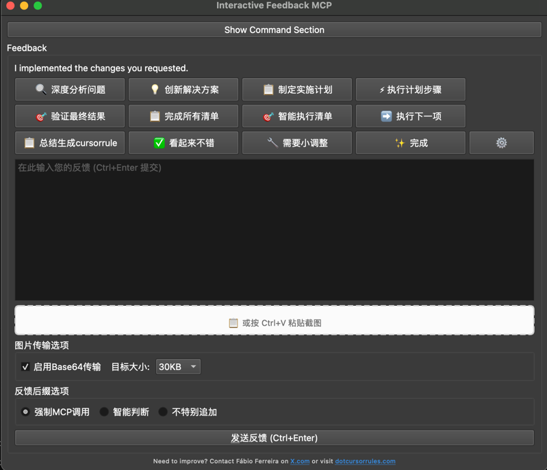
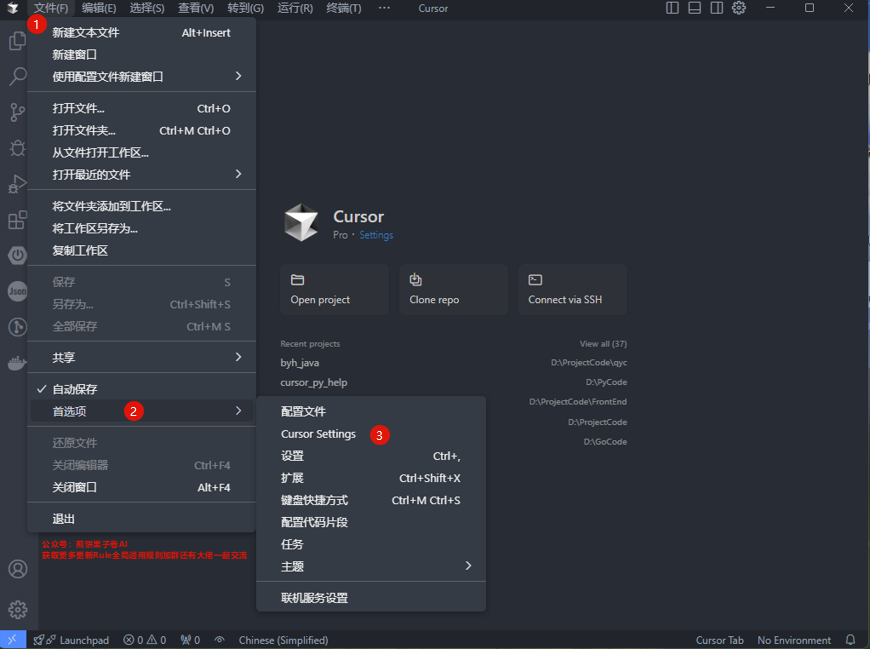
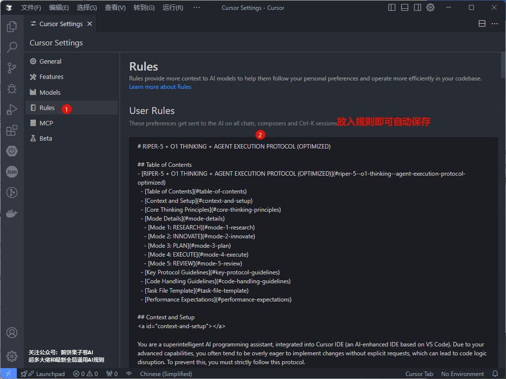
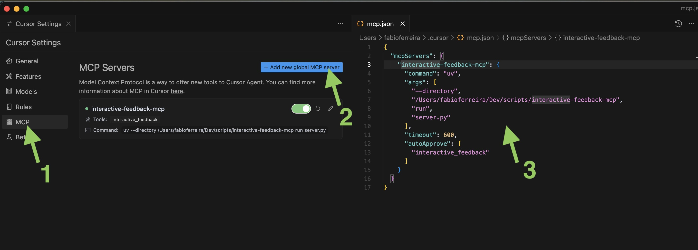
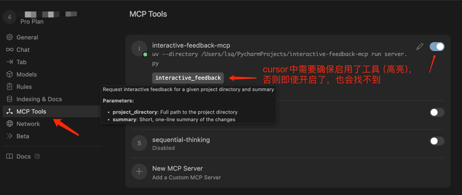

# Interactive Feedback MCP - 交互式反馈MCP服务器

**🌐 Language / 語言切換:** **简体中文** |[English](README_EN.md)

一个强大的 [MCP 服务器](https://modelcontextprotocol.io/)，在AI辅助开发工具如 [Cursor](https://www.cursor.com) 中实现无缝的人机协作工作流程。该服务器允许您运行命令、查看输出结果，并通过直观的图形界面直接向AI提供丰富的文本反馈。



## ✨ 核心特性

### 🚀 先进的用户界面
- **现代化Qt图形界面** - 直观设计和响应式布局
- **多语言支持** - 中英文界面即时切换
- **图片拖拽支持** - 自动压缩和Base64编码
- **智能按钮布局** - 自适应屏幕尺寸和用户偏好
- **工具菜单集成** - 有序组织的系统维护功能

### 🎯 智能快捷响应系统
- **预配置响应按钮** - 覆盖常见开发工作流程
- **RIPER-5协议集成** - (研究 → 创新 → 计划 → 执行 → 审查)
- **可自定义快捷操作** - 支持拖拽重新排序
- **项目特定配置** - 记住您的偏好设置
- **智能MCP调用** - 智能判断何时需要请求反馈

### 🔧 强大的命令执行
- **跨平台命令执行** - 实时输出流传输
- **自动执行模式** - 适用于重复性工作流程
- **进程管理** - 启动/停止控制和状态监控
- **命令历史** - 每个项目的命令持久化
- **控制台输出** - 语法高亮和滚动支持

### 🖼️ 高级图片处理
- **剪贴板图片支持** - Ctrl+V粘贴功能
- **多种图片格式** - PNG、JPG、JPEG、GIF、BMP、WebP
- **智能压缩** - 可配置的目标大小（30KB-100KB）
- **Base64传输** - 直接AI图像识别
- **临时文件管理** - 自动清理功能

### ⚙️ 专业配置管理
- **项目特定设置** - 使用Qt QSettings安全存储
- **按钮自定义** - 尺寸、可见性和内容控制
- **性能优化** - 布局缓存和批量更新
- **备份和恢复** - 配置管理功能
- **主题和布局** - 持久化存储偏好设置

## 💡 为什么使用这个工具？

通过引导助手与用户确认而不是分支到投机性的高成本工具调用，该模块可以大幅减少像Cursor这样的平台上的高级请求数量（例如OpenAI工具调用）。在某些情况下，它帮助将原本多达25个工具调用合并为单个具有反馈感知的请求——节省资源并提高性能。

### 性能优势
- **降低API成本** - 通过最小化不必要的工具调用
- **提高准确性** - 在关键决策点进行人工验证
- **增强生产力** - 通过简化的反馈工作流程
- **更好的协作** - AI和人类开发者之间的配合

## 🎮 使用方法

### 基本工作流程
1. **启动界面** - 当AI助手调用时启动
2. **查看摘要** - 审查AI已完成的工作
3. **使用快捷响应按钮** - 处理常见反馈场景：
   - ✅ **看起来不错** - 批准当前工作
   - 🔧 **需要小调整** - 请求轻微修改
   - 📋 **完成所有清单** - 执行剩余任务
   - 🎯 **智能执行清单** - 智能处理剩余项目

### 高级功能

#### 🔍 RIPER-5 协议工作流程
系统包含用于系统性问题解决的专用按钮：
- **🔍 深度分析问题** - 深度分析模式和系统性分解
- **💡 创新解决方案** - 头脑风暴多种方法并评估选项
- **📋 制定实施计划** - 生成详细的实施计划和审查检查点
- **⚡ 执行计划步骤** - 按计划执行，带有交互反馈
- **🎯 验证最终结果** - 根据需求进行全面验证

#### 🖼️ 图片集成
1. **拖拽图片** - 直接拖入界面或使用Ctrl+V粘贴截图
2. **配置传输选项** - 启用Base64进行AI识别
3. **调整压缩设置** - 选择目标大小以获得最佳性能
4. **发送前预览** - 使用缩略图预览功能

#### ⚙️ 自定义选项
1. **编辑快捷按钮** - 点击⚙️按钮自定义响应
2. **工具菜单** - 访问系统功能，如临时文件清理
3. **语言切换** - 在中英文界面之间切换
4. **布局偏好** - 调整按钮大小和窗口布局

### 命令执行功能
- **切换命令区域** - 显示/隐藏命令执行面板
- **自动执行模式** - 启用启动时自动命令运行
- **实时输出** - 查看命令执行结果
- **进程控制** - 启动、停止和监控运行中的进程

## 📋 提示词工程

为了获得最佳效果，请将以下内容添加到您的AI助手自定义提示中任意一种：

### 示例1：
```
每当您想要提问时，始终调用MCP `interactive_feedback`。
每当您即将完成用户请求时，调用MCP `interactive_feedback`而不是简单地结束过程。
继续调用MCP直到用户反馈为空，然后结束请求。

使用RIPER-5协议按钮时，遵循系统化方法：
1. 🔍 研究：在提出解决方案之前彻底分析问题
2. 💡 创新：探索多种创造性方法
3. 📋 计划：创建详细的、可审查的实施计划
4. ⚡ 执行：按步骤执行计划，设置检查点
5. 🎯 审查：根据原始需求验证结果
```

### 示例2：
配套当前mcp的cursor提示词：[RIPER-5-cursor-rule](RIPER-5-cursor-rule.txt)




这确保您的AI助手有效使用MCP服务器并遵循结构化的问题解决方法。

## 🔧 配置

此MCP服务器使用Qt的`QSettings`在每个项目基础上存储配置，包括：

### 存储的设置
- **命令偏好** - 每个项目的默认命令
- **执行设置** - 自动执行偏好和命令历史
- **UI偏好** - 窗口几何、按钮可见性、语言选择
- **快捷响应自定义** - 自定义按钮、大小和排列
- **图片处理设置** - 压缩偏好和传输选项
- **性能设置** - 布局缓存和更新偏好

### 存储位置
设置存储在特定于平台的位置：
- **Windows**: 注册表 `HKEY_CURRENT_USER\Software\FabioFerreira\InteractiveFeedbackMCP`
- **macOS**: `~/Library/Preferences/com.FabioFerreira.InteractiveFeedbackMCP.plist`
- **Linux**: `~/.config/FabioFerreira/InteractiveFeedbackMCP.conf`

每个项目根据其目录路径哈希获得唯一的配置组。

## 🚀 安装

### 前置要求
- **Python 3.11 或更新版本**
- **[uv](https://github.com/astral-sh/uv)** (Python包管理器)
  - Windows: `pip install uv`
  - Linux/Mac: `curl -LsSf https://astral.sh/uv/install.sh | sh`

### 安装步骤

1. **克隆仓库：**
   ```bash
   git clone https://github.com/liaosiqian/interactive-feedback-mcp.git
   cd interactive-feedback-mcp
   ```

2. **安装依赖：**
   ```bash
   uv venv
   uv sync --index-url https://pypi.tuna.tsinghua.edu.cn/simple
   ```


### 与AI工具集成

#### Cursor 配置


添加到您的 `mcp.json` 配置文件：
```json
{
  "mcpServers": {
    "interactive-feedback-mcp": {
      "command": "uv",
      "args": [
        "--directory",
        "/path/to/interactive-feedback-mcp",
        "run",
        "server.py"
      ],
      "timeout": 600,
      "autoApprove": [
        "interactive_feedback"
      ]
    }
  }
}
```

**重要提醒：** 将 `/path/to/interactive-feedback-mcp` 替换为您克隆仓库的实际路径。

#### Cline / Windsurf 配置
在相应工具的MCP设置中使用类似的配置原理，指定 `interactive-feedback-mcp` 作为服务器标识符。

## 🛠️ 开发

### 开发模式
使用Web界面运行服务器进行测试：
```bash
uv run fastmcp dev server.py
```

这会打开一个用于测试MCP工具交互的Web界面。

### 项目结构
```
interactive-feedback-mcp/
├── feedback_ui.py          # 主UI控制器 (773行)
├── ui_layout.py           # 布局管理 (372行)  
├── ui_performance.py      # 性能优化 (120行)
├── button_core.py         # 按钮核心逻辑 (195行)
├── ui_events.py          # 事件处理 (178行)
├── ui_settings.py        # 配置管理 (142行)
├── feedback_logic.py     # 业务逻辑 (215行)
├── quick_response_manager.py # 快捷响应系统 (180行)
├── ui_dialogs.py         # 对话框组件 (580行)
├── cleanup_temp_images.py # 图片清理工具 (222行)
├── clipboard_image_widget.py # 图片处理 (540行)
├── i18n.py              # 国际化 (352行)
├── server.py            # MCP服务器入口点 (74行)
└── config.py            # 配置工具 (44行)
```

### 架构亮点
- **模块化设计** - 清晰的关注点分离
- **基于Qt的UI** - 现代设计模式
- **性能优化** - 包括布局缓存和批量更新
- **全面的国际化** - 支持多语言
- **健壮的错误处理** - 优雅降级

## 🔨 可用工具

### interactive_feedback
用于请求用户反馈的主要工具，包含丰富的上下文。

**使用示例：**
```xml
<use_mcp_tool>
  <server_name>interactive-feedback-mcp</server_name>
  <tool_name>interactive_feedback</tool_name>
  <arguments>
    {
      "project_directory": "/path/to/your/project",
      "summary": "我已经实现了请求的功能，需要您对实现方法的反馈。"
    }
  </arguments>
</use_mcp_tool>
```

**参数：**
- `project_directory` (字符串): 当前项目目录的路径
- `summary` (字符串): 已完成工作或问题的简要描述

**返回值：**
- `logs` (字符串): 任何执行命令的控制台输出
- `interactive_feedback` (字符串): 用户的文本反馈和指示

## 🎯 最佳实践

### 对于AI助手
1. **始终提供上下文** - 在摘要参数中提供详细信息
2. **使用特定的项目目录** - 确保配置隔离正确
3. **等待用户反馈** - 在进行重大更改之前
4. **利用快捷响应按钮** - 通过提及其可用性
5. **遵循RIPER-5协议** - 进行系统性问题解决

### 对于用户
1. **自定义快捷按钮** - 针对您最常见的响应
2. **使用图片功能** - 提供视觉反馈和示例
3. **配置项目特定设置** - 适应不同的工作流程
4. **保持临时文件清洁** - 使用工具菜单清理选项
5. **根据需要切换语言** - 适用于国际协作

### 性能技巧
1. **启用自动执行** - 适用于重复性命令工作流程
2. **谨慎使用Base64传输** - 对于大图片
3. **自定义按钮布局** - 匹配您的屏幕尺寸
4. **利用工具菜单** - 保持界面有序

## 🌟 致谢与联系

本项目最初由 Fábio Ferreira ([@fabiomlferreira](https://x.com/fabiomlferreira)) 开发。

[RIPER-5-cursor-rule.txt](RIPER-5-cursor-rule.txt) 原始版本来源于 `煎饼果子(86)`大佬整理

## 📄 许可证

这个项目是开源的。请参考许可证文件了解详情。

## 🚀 贡献

欢迎贡献！请随时提交问题、功能请求或拉取请求来改进这个工具。

## 📚 功能详细说明

### 🎨 界面自定义
- **按钮大小调整** - 小号(100x30)、中号(120x40)、大号(150x45)或自定义尺寸
- **语言切换** - 运行时即时在中英文之间切换
- **布局适配** - 自动适应不同屏幕尺寸和分辨率
- **主题保存** - 记住窗口大小、位置和用户偏好

### 🔄 工作流程集成
- **RIPER-5协议** - 结构化的五阶段问题解决方法
- **检查清单管理** - 智能执行和进度跟踪
- **项目配置隔离** - 每个项目独立的设置和历史
- **自动化脚本** - 支持重复性任务的自动执行

### 🖥️ 命令行集成
- **实时进程监控** - 查看命令执行状态和输出
- **跨平台兼容** - Windows、macOS、Linux全平台支持
- **错误处理** - 优雅处理命令失败和异常情况
- **输出格式化** - 语法高亮和可读性优化

### 📊 性能监控
- **UI响应优化** - 批量更新减少界面卡顿
- **内存使用监控** - 智能缓存管理
- **网络传输优化** - 图片压缩和传输效率
- **调试统计** - 性能指标收集和分析

这个工具设计用于提升AI辅助开发的效率和准确性，通过人机协作实现更好的开发体验。 