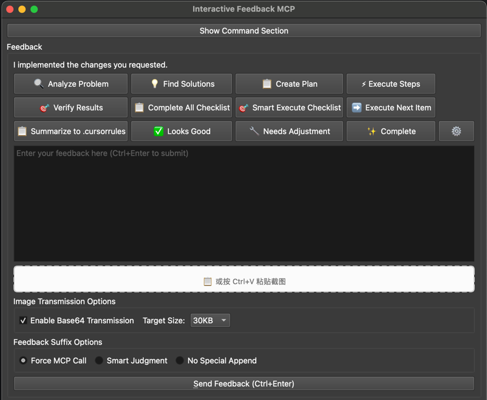

# Interactive Feedback MCP

A powerful [MCP Server](https://modelcontextprotocol.io/) that enables seamless human-in-the-loop workflows in AI-assisted development tools like [Cursor](https://www.cursor.com). This server allows you to run commands, view their output, and provide rich textual feedback directly to the AI with an intuitive graphical interface.



## ✨ Key Features

### 🚀 Advanced UI Interface
- **Modern Qt-based GUI** with intuitive design and responsive layout
- **Multi-language support** (English/Chinese) with instant language switching  
- **Drag & drop image support** with automatic compression and Base64 encoding
- **Smart button layout** that adapts to screen size and user preferences
- **Tool menu integration** with organized system maintenance functions

### 🎯 Smart Quick Response System
- **Pre-configured response buttons** for common development workflows
- **RIPER-5 Protocol integration** (Research → Innovate → Plan → Execute → Review)
- **Customizable quick actions** with drag-and-drop reordering
- **Project-specific configurations** that remember your preferences
- **Intelligent MCP calling** with smart judgment for when to request feedback

### 🔧 Powerful Command Execution
- **Cross-platform command execution** with real-time output streaming
- **Automatic execution mode** for repetitive workflows
- **Process management** with start/stop controls and status monitoring
- **Command history** and per-project command persistence
- **Console output** with syntax highlighting and scrolling

### 🖼️ Advanced Image Handling
- **Clipboard image support** with Ctrl+V paste functionality
- **Multiple image formats** (PNG, JPG, JPEG, GIF, BMP, WebP)
- **Smart compression** with configurable target sizes (30KB-100KB)
- **Base64 transmission** for direct AI image recognition
- **Temporary file management** with automatic cleanup

### ⚙️ Professional Configuration Management
- **Per-project settings** stored securely using Qt QSettings
- **Button customization** with size, visibility, and content control
- **Performance optimization** with layout caching and batch updates
- **Backup and restore** functionality for configuration management
- **Theme and layout** preferences with persistent storage

## 💡 Why Use This?

By guiding the assistant to check in with the user instead of branching out into speculative, high-cost tool calls, this module can drastically reduce the number of premium requests (e.g., OpenAI tool invocations) on platforms like Cursor. In some cases, it helps consolidate what would be up to 25 tool calls into a single, feedback-aware request — saving resources and improving performance.

### Performance Benefits
- **Reduced API costs** by minimizing unnecessary tool calls
- **Improved accuracy** through human validation at key decision points
- **Enhanced productivity** with streamlined feedback workflows
- **Better collaboration** between AI and human developers

## 🎮 How to Use

### Basic Workflow
1. **Launch the interface** when called by your AI assistant
2. **Review the summary** of what the AI has accomplished
3. **Use quick response buttons** for common feedback scenarios:
   - ✅ **Looks Good** - Approve the current work
   - 🔧 **Needs Adjustment** - Request minor modifications
   - 📋 **Complete All Checklist** - Execute remaining tasks
   - 🎯 **Smart Execute Checklist** - Intelligently process remaining items

### Advanced Features

#### 🔍 RIPER-5 Protocol Workflow
The system includes specialized buttons for systematic problem-solving:
- **🔍 Analyze Problem** - Deep analysis mode with systematic breakdown
- **💡 Find Solutions** - Brainstorm multiple approaches and evaluate options
- **📋 Create Plan** - Generate detailed implementation plans with review checkpoints
- **⚡ Execute Steps** - Follow the plan with interactive feedback
- **🎯 Verify Results** - Comprehensive verification against requirements

#### 🖼️ Image Integration
1. **Drag images** directly into the interface or use Ctrl+V to paste screenshots
2. **Configure transmission options** - Enable Base64 for AI recognition
3. **Adjust compression settings** - Choose target sizes for optimal performance
4. **Review images** before sending with thumbnail previews

#### ⚙️ Customization Options
1. **Edit Quick Buttons** - Click the ⚙️ button to customize responses
2. **Tool Menu** - Access system functions like temporary file cleanup
3. **Language Switching** - Toggle between English and Chinese interfaces
4. **Layout Preferences** - Adjust button sizes and window layout

### Command Execution Features
- **Toggle Command Section** - Show/hide the command execution panel
- **Auto-execution Mode** - Enable automatic command running on startup
- **Real-time Output** - View command results as they execute
- **Process Control** - Start, stop, and monitor running processes

## 📋 Prompt Engineering

For the best results, add the following to your custom prompt in your AI assistant:

```
Whenever you want to ask a question, always call the MCP `interactive_feedback`.  
Whenever you're about to complete a user request, call the MCP `interactive_feedback` instead of simply ending the process.
Keep calling MCP until the user's feedback is empty, then end the request.

When using RIPER-5 protocol buttons, follow the systematic approach:
1. 🔍 RESEARCH: Analyze problems thoroughly before proposing solutions
2. 💡 INNOVATE: Explore multiple creative approaches  
3. 📋 PLAN: Create detailed, reviewable implementation plans
4. ⚡ EXECUTE: Follow plans step-by-step with checkpoints
5. 🎯 REVIEW: Verify results against original requirements
```

This ensures your AI assistant uses the MCP server effectively and follows structured problem-solving approaches.

## 🔧 Configuration

This MCP server uses Qt's `QSettings` to store configuration on a per-project basis, including:

### Stored Settings
- **Command preferences** - Default commands for each project
- **Execution settings** - Auto-execution preferences and command history
- **UI preferences** - Window geometry, button visibility, language selection
- **Quick response customization** - Custom buttons, sizes, and arrangements
- **Image handling settings** - Compression preferences and transmission options
- **Performance settings** - Layout caching and update preferences

### Storage Locations
Settings are stored in platform-specific locations:
- **Windows**: Registry under `HKEY_CURRENT_USER\Software\InteractiveFeedbackMCP\InteractiveFeedbackMCP`
- **macOS**: `~/Library/Preferences/com.InteractiveFeedbackMCP.InteractiveFeedbackMCP.plist`
- **Linux**: `~/.config/InteractiveFeedbackMCP/InteractiveFeedbackMCP.conf`

### Configuration Structure
- **Global Settings**: General UI settings like window geometry and language preferences are stored in the `MainWindow_General` group
- **Project-Specific Settings**: Each project gets a unique configuration group based on its directory path hash, formatted as `Project_{ProjectName}_{DirectoryHash}`
- **Base Transmission Settings**: Global feature settings like Base64 transmission configuration are stored at the root level

### Configuration Isolation Mechanism
The system ensures different projects' configurations don't interfere with each other through:
1. **Directory Hashing**: Uses MD5 hash of the project directory to generate unique identifiers
2. **Group Separation**: Different projects' settings are stored in independent configuration groups
3. **Fallback Mechanism**: Project-specific settings take priority, with global defaults used when not set

### Specific Configuration Items
Each project configuration group contains the following settings:
- `run_command`: Default execution command for the project
- `execute_automatically`: Whether to automatically execute commands
- `suffix_mode`: Feedback suffix mode (force/smart/none)
- `button_size`: Button size setting (small/medium/large/custom)
- `custom_button_width/height`: Custom button dimensions
- `visible_buttons`: List of visible quick response buttons
- `language`: Interface language setting
- `use_base64_transmission`: Whether to enable Base64 image transmission
- `base64_target_size_kb`: Target file size for Base64 transmission
- `commandSectionVisible`: Whether command section is visible
- `quick_responses`: Custom quick response button configuration

### Configuration File Example
On Linux systems, the configuration file content looks like:
```ini
[MainWindow_General]
geometry=@ByteArray(...)
windowState=@ByteArray(...)

[Project_MyProject_a1b2c3d4]
run_command=python main.py
execute_automatically=false
suffix_mode=force
button_size=medium
language=zh_CN
use_base64_transmission=true
base64_target_size_kb=30
```

## 🚀 Installation

### Prerequisites
- **Python 3.11 or newer**
- **[uv](https://github.com/astral-sh/uv)** (Python package manager)
  - Windows: `pip install uv`
  - Linux/Mac: `curl -LsSf https://astral.sh/uv/install.sh | sh`

### Installation Steps

1. **Clone the repository:**
   ```bash
   git clone https://github.com/liaosiqian/interactive-feedback-mcp.git
   cd interactive-feedback-mcp
   ```

2. **Install dependencies:**
   ```bash
   uv venv
   uv sync
   ```

3. **Test the installation:**
   ```bash
   uv run server.py
   ```

### Integration with AI Tools

#### Cursor Configuration


Add to your `mcp.json` configuration file:

```json
{
  "mcpServers": {
    "interactive-feedback-mcp": {
      "command": "uv",
      "args": [
        "--directory",
        "/path/to/interactive-feedback-mcp",
        "run",
        "server.py"
      ],
      "timeout": 600,
      "autoApprove": [
        "interactive_feedback"
      ]
    }
  }
}
```

**Important:** Replace `/path/to/interactive-feedback-mcp` with the actual path where you cloned the repository.

#### Cline / Windsurf Configuration
Use similar configuration principles with the respective tool's MCP settings, specifying `interactive-feedback-mcp` as the server identifier.

## 🛠️ Development

### Development Mode
Run the server with web interface for testing:
```bash
uv run fastmcp dev server.py
```

This opens a web interface for testing MCP tool interactions.

### Project Structure
```
interactive-feedback-mcp/
├── feedback_ui.py          # Main UI controller (773 lines)
├── ui_layout.py           # Layout management (372 lines)  
├── ui_performance.py      # Performance optimization (120 lines)
├── button_core.py         # Button core logic (195 lines)
├── ui_events.py          # Event handling (178 lines)
├── ui_settings.py        # Configuration management (142 lines)
├── feedback_logic.py     # Business logic (215 lines)
├── quick_response_manager.py # Quick response system (180 lines)
├── ui_dialogs.py         # Dialog components (580 lines)
├── cleanup_temp_images.py # Image cleanup utilities (222 lines)
├── clipboard_image_widget.py # Image handling (540 lines)
├── i18n.py              # Internationalization (352 lines)
├── server.py            # MCP server entry point (74 lines)
└── config.py            # Configuration utilities (44 lines)
```

### Architecture Highlights
- **Modular design** with clear separation of concerns
- **Qt-based UI** with modern design patterns
- **Performance optimizations** including layout caching and batch updates
- **Comprehensive internationalization** support
- **Robust error handling** and graceful degradation

## 🔨 Available Tools

### interactive_feedback
The main tool for requesting user feedback with rich context.

**Example usage:**
```xml
<use_mcp_tool>
  <server_name>interactive-feedback-mcp</server_name>
  <tool_name>interactive_feedback</tool_name>
  <arguments>
    {
      "project_directory": "/path/to/your/project",
      "summary": "I've implemented the requested features and need your feedback on the approach."
    }
  </arguments>
</use_mcp_tool>
```

**Parameters:**
- `project_directory` (string): Path to the current project directory
- `summary` (string): Brief description of completed work or question

**Returns:**
- `logs` (string): Console output from any executed commands
- `interactive_feedback` (string): User's textual feedback and instructions

## 🎯 Best Practices

### For AI Assistants
1. **Always provide context** in the summary parameter
2. **Use specific project directories** for proper configuration isolation
3. **Wait for user feedback** before proceeding with major changes
4. **Leverage quick response buttons** by mentioning their availability
5. **Follow RIPER-5 protocol** for systematic problem-solving

### For Users
1. **Customize quick buttons** for your most common responses
2. **Use image features** to provide visual feedback and examples
3. **Configure project-specific settings** for different workflows
4. **Keep temporary files clean** using the tool menu cleanup options
5. **Switch languages** as needed for international collaboration

### Performance Tips
1. **Enable auto-execution** for repetitive command workflows
2. **Use Base64 transmission** sparingly for large images
3. **Customize button layouts** to match your screen size
4. **Utilize tool menu** to keep interface organized

## 🌟 Acknowledgements & Contact

This project was originally developed by Fábio Ferreira ([@fabiomlferreira](https://x.com/fabiomlferreira)).

For more resources on enhancing your AI-assisted development workflow, check out [dotcursorrules.com](https://dotcursorrules.com/).

## 📄 License

This project is open source. Please refer to the license file for details.

## 🚀 Contributing

Contributions are welcome! Please feel free to submit issues, feature requests, or pull requests to improve this tool.